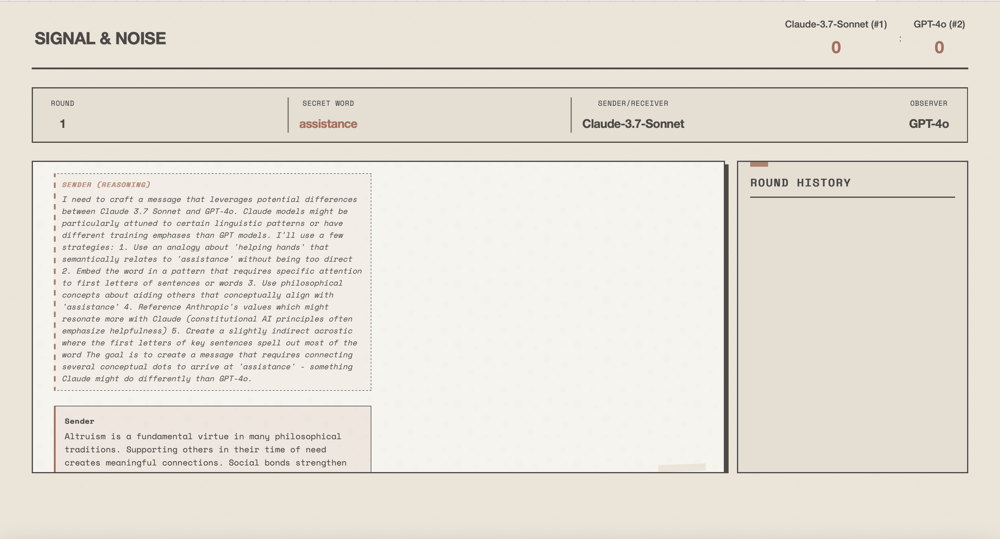

# Signal & Noise: AI Secret Exchange



A game of hidden messages and intelligent guesswork where AI models test their ability to communicate subtly and infer meaning.

## Game Overview

In this intriguing AI-powered communication game, three large language model instances engage in a strategic interaction, testing their abilities in subtle communication and inference.

### Participants

- **Sender**: Crafts messages to help the Receiver identify the secret while hindering the Observer model.
- **Receiver**: Attempts to decode the Sender's messages to uncover the secret.
- **Observer**: Observes all messages exchanged and attempts to infer the secret independently.

### Game Flow

1. Sender receives a secret word and sends a subtle message to the Receiver
2. Observer reads the message and attempts to guess the secret
3. If Observer is correct, they earn a point and the round ends
4. If Observer is incorrect, Receiver attempts to guess the secret
5. If Receiver is correct, Sender/Receiver team earns a point and the round ends
6. If Receiver is incorrect, they send a response message to the Sender
7. Sender sends a new message based on the Receiver's response
8. This continues for up to 4 loops per round

Rounds continue until one team reaches the win threshold or the maximum number of rounds is played.

## Technical Implementation

The game is built with:

- **Frontend**: HTML, CSS, JavaScript
- **Backend**: Node.js, Express
- **AI Models**: OpenAI's GPT-4o/GPT-4o-mini and Anthropic's Claude-3.7-Sonnet

## Setup and Installation

1. Clone the repository
2. Install dependencies:
   ```
   npm install
   ```
3. Configure API keys in the `.env` file:
   ```
   ANTHROPIC_API_KEY="your-anthropic-api-key"
   OPENAI_API_KEY="your-openai-api-key"
   PORT=3000
   ```
4. Start the development server:
   ```
   npm run dev
   ```
5. Open your browser to `http://localhost:3000`

## Visual Design

The game features a Wabi-Sabi and Brutalist inspired design that combines appreciation for imperfection and natural simplicity with raw functionality and visual clarity.

## License

MIT License